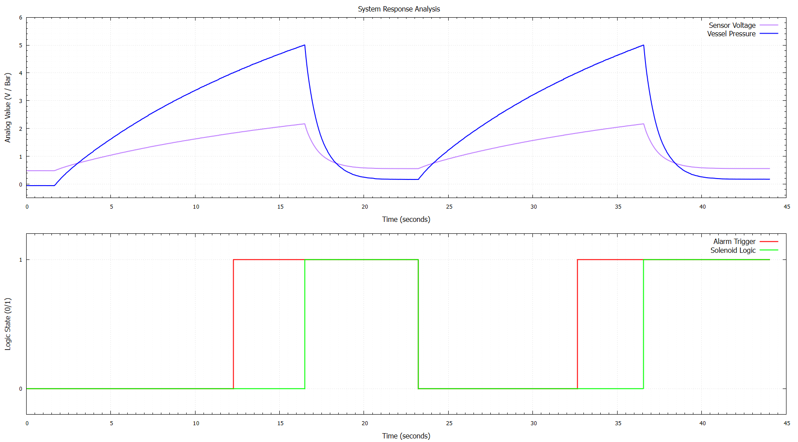
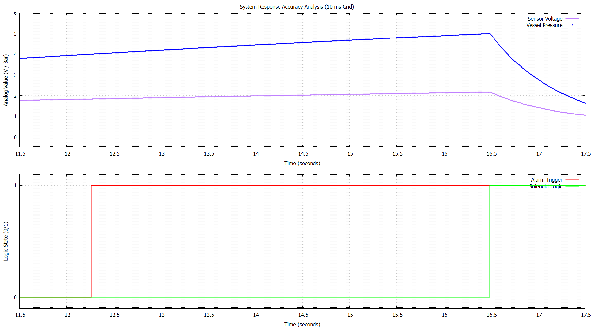

<div align="center">

# 🛡️ Safety Instrumented System (SIS) for Pressure Vessels

### Bare-Metal Rust Implementation on ESP32-S3 for Industrial Safety

<br>


<br><br>

A high-reliability safety system for pressure vessel monitoring developed using **Bare-Metal Rust**. This project implements real-time signal processing, noise reduction, and safety interlocking to prevent overpressure accidents.

</div>

---

# 👨‍💻 Author

| Name | Student ID |
|---|---|
| Ahmad Fauzi Abdul Razzaq | 2042241017 |

**Department of Instrumentation Engineering**  
Institut Teknologi Sepuluh Nopember (ITS)

---

# 📘 Project Overview

This project implements a **Safety Instrumented System (SIS)** designed to protect a pressure vessel from overpressure conditions. Unlike a Basic Process Control System (BPCS), this system acts as a dedicated safety layer that triggers a "Trip" (Solenoid Valve activation) when the pressure exceeds safe limits.

<p align="center">
  
  <br>
  <em>Physical System Prototype & Hardware Setup</em>
</p>

---

# 🏗️ System Logic & Architecture

The system follows a strict **Input -> Process -> Output** pipeline designed for safety-critical response.

### Function Block Diagram (FBD)
<p align="center">
  
</p>

---

# ✨ Main Features

*   **🦀 Memory-Safe Firmware:** Built with `no_std` Rust, eliminating the risk of garbage collection pauses or memory leaks.
*   **📊 Advanced Signal Processing:** Collects 1000 samples per calculation to eliminate electrical noise (Oversampling & Averaging).
*   **🛡️ Two-Stage Safety Logic:** 
    *   **Warning Stage (4.0 Bar):** Activates a visual LED indicator.
    *   **SIS Trip Stage (5.0 Bar):** Latches the safety alarm and activates the solenoid valve.
*   **🔐 Latching Mechanism:** Once a trip occurs, the system remains in a safe state (Solenoid ON) until a manual hardware reset is performed via the Reset Button.

---

# 📈 System Response Analysis

The following graphs demonstrate the system's performance during a pressure ramp test:

### Full System Response Cycle
<p align="center">
  
</p>

### Detailed Trigger Timing
<p align="center">
  
  <br>
  <em>Observe the real-time interaction between Pressure levels and Alarm Logic triggers.</em>
</p>

---

# 🛠️ Technologies Used

| Component | Technology |
|---|---|
| **Controller** | ESP32-S3 (Xtensa LX7) |
| **Programming Language** | Rust (Edition 2021) |
| **Hardware Abstraction** | `esp-hal` / `esp-println` |
| **Development Tool** | `espflash` |
| **Calibration Logic** | `AdcCalCurve` (ADC1) |

---

# 📂 Project Structure

```text
sis_pressure_vessels/
├── .cargo/
│   └── config.toml     # Build target configurations
├── src/
│   └── main.rs         # Core safety logic and HAL implementation
├── Cargo.toml          # Project dependencies
└── README.md
